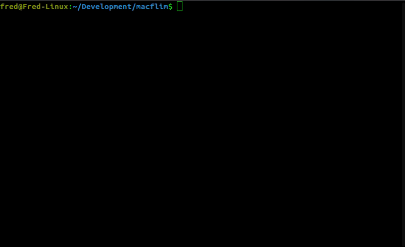

# MacFlim, the true Mac video player

MacFlim is a video encoder and player for black and white vintage Macintoshes, now in its second incarnation.

_The iPod introduction should have waited for MacFlim to be available_

MacFlim brings movie playing abilities to the most popular members of the Macintosh familiy, namely the Macintosh XL, Macintosh 128K, Macintosh 512K, Mac Plus, Mac SE, Mac SE/30 and the Macintosh Portable, on their beautiful internal back and white 512x342 display (or in a part of it for the Mac XL and the Portable).

## What is in the repository?

* The source code and binaries for "MacFlim", the popular video player for the vintage mac.

* The source code and binaries for "Mini MacFlim", a low-memory version of the popular video player for the vintage mac.

* The source code of flimmaker, the command line encoder. It runs on Mac and Linux (and could probably compiled on windows with a C++20 compiler).

With this code, you should be able to encode and play a video sequence on your vintage mac.

## I have no mac and I must stream!

Fear not, if you have no access to a vintage mac, or if you want to look at results without having to transfer cumbersome files from your desktop to your mac, you can generate pixel exact movies that will let you know how the playback would look on the targeted hardware. See the ``--mp4`` option.

_Create flims and immediately admire them. Note the gif [has reduced frame rate](https://www.biphelps.com/blog/The-Fastest-GIF-Does-Not-Exist), reality is twice as smooth. And have sound._

## What is new since MacFlim 1.0?

Well, the main change is that flims now have sound. This needed a complete rewrite of both the player and the encoder. All your old flims are now obsolete, sorry.

Note that the new player app is currently less fancy than MacFlim 1.0. It only lets you play full screen flims. But with glorious 8 bits 22KHz mono sound. Old features of the player may be added back.

Encoding input is greatly simplified: you don't have to resize the input to 512x342 any more. You don't need to have it in grayscale. You don't have to have it in pgm format. You can directly feed mp4 movies, or even youtube or vimeo urls to the encoder.

Output is different too: flims are encoded relative to a target "profile", and the flim will only play correctly on hardware that would support this profile.

To ease with testing, an optional mp4 of the flim can be generated. This will let you iterate and tweak the encoding parameters without the need to transfer to your vintage hardware or, god forbid, emulator.

## How do I play flims on my Mac?

Head to http://www.macflim.com/macflim2 to download the standalone player.
Alternatively, if you want to have the latest version and the source code, the 'MacFlim Source Code.dsk' file is a disk image, containing a working System 6.0.8, the MacFlim source code and binaries, and a THINK 5 development environment. This is what is used to develop MacFlim and Mini MacFlim.

## Ok, how do I compile the encoder?

The pre-requisites are ffmpeg, youtube-dl (optional) and ImageMagick (optional)

* ``ffmpeg`` libraries are required for compilation. 
* ``yt-dlp`` or ``youtube-dl`` is used if you want to directly encode movies from youtube or vimeo (or others).
* ``ImageMagick`` is used if you want to generate ``gif`` files.

On a Mac:

    brew install ffmpeg
    brew install youtube-dl
    brew install ImageMagick

Optionally, yt-dlp should be installable with:

    brew install yt-dlp/taps/yt-dlp

On a linux (ubuntu):

    # Note: make sure you have a recent c++20 compiler
    sudo apt-get update
    sudo apt-get install git
    sudo apt-get install build-essential
    sudo apt-get install g++-11

    # Make sure you get the dependecies
    sudo apt-get install libavformat-dev libavcodec-dev libavutil-dev
    sudo apt-get install youtube-dl
    sudo apt-get install imagemagick

Note, ``youtube-dl`` is not easy to keep up to date from apt. See https://github.com/ytdl-org/youtube-dl#installation for a better way to install it. Also, as ``youtube-dl`` is currently quite slow ``yt-dlp`` will be used instead if installed (``yt-dlp`` cannot be installed via apt for now, see https://github.com/yt-dlp/yt-dlp for instructions)

You can the get the source code using:

    git clone https://github.com/fstark/macflim.git

(or your regional equivalent)

Compiling is as simple as opening a terminal and typing ``make``. There are some warnings of obsolete functions use with ffmpeg, but it is already a miracle that it works. If anyone has a pull request to fix this, let me know.

After compilation, you can generate a sample flim using:

    ./flimmaker 'https://www.youtube.com/watch?v=dQw4w9WgXcQ' --mp4 out.mp4

This will download the video and encode it for se30 playback (the default), as 'out.flim'. It will take a couple of minutes. You can then immediately play the ``out.mp4`` file, which is identical to the se30 playback, including a mono output. Enjoy!

## General flim creation options

There are quite a few options that control the flim generation.

The general format is:

    flimmaker [input-file-name] [--option-name value]

``input-file-name`` can be either:

* A local mp4 file. It will be opened using the installed ffmpeg library, and the "best" video and audio channels will be read and converted.

* An url supported by ``youtube-dl`` (or ``yy-dlp``). If the ``input-file-name`` starts with ``https://``, flimmaker will try to use ``youtube-dl`` to download the specified file and encode it. See the ``--cache`` option to avoid downloading multiple times the same source.

* A set of local 512x342 8 bits pgm files. If the ``input-file-name`` ends with ``.pgm``, it will be considered as a ``printf`` pattern and used to read local images (starting at index 1? #### CHECK ME). For instance, ``movie-%06d.pgm`` will read all files named ``movie-000001.pgm``, ``movie-000002.pgm``, etc... [Yes, if one uses '%s', the app will crash](https://github.com/fstark/macflim/issues/4). See the ``--fps`` and ``--audio`` option to specify the audio for pgm files.

All other arguments to ``flimmaker`` go in pairs.

### --flim **flimname**

Specifies the name of the generated flim file. If there is no ``--flim`` option specified, ``flimmaker`` uses *out.flim*.

### --mp4 **file**

Creates a 512x342 60fps mp4 file that renders exactly the flim, with its associated sound. This can be used to view the flim without having to load the ``.flim`` file to a vintage Macintosh, or uploaded to the web. While the sound channel is 44KHz 16 bits, it really contains the 22KHz 8 bits Macintosh sound. This is by far the easiest way to iterate with the encoder parameters. Note that mp4 is no designed to encode such movies, and the result are *huge* because encoding high frequency black and white images at 60fps efficiently was definitely not a goal for H.264. Mp4 files are often around 25Mbits/second. A 90 minute movie would be around 16GB...

### --pgm **pattern**

Write every generated frame as a pgm file. This is useful to embed a specific frame in a web site, or to look at the detail of the generation of different set of parameters. The pattern should contain a single '%d', which will be replaced by the frame number. Existing files with this pattern will be removed. Again, if one uses '%s', the app will crash. Example: ``--pgm out-%06d.pgm``. Beware, it is an extremely efficient way to generate ten of thousands of files. Note that the files matching the pattern are removed before generation.

### --gif **file**

Creates an animated gif file version of the flim. The animated gif is at 20 frame per second. using a gif makes it easier to embed in a web page. Be careful, gif files can get very large, so limit the duration of the output.

### --cache **flimname**

To avoid downloading the same file multiple times, the ``--cache`` argument can be used to specify a destination to download the file to if it doesn't already exist. ``flimmaker`` will use this file if it exists, or download it there otherwise. This is only used with URL specifiers.

### --profile **plus**|**se**|**se30**|**perfect**|**xl**|**512**

Specifies the encoding/playback profile you want to use.

* plus : The plus profile aims at playing the resulting file on a Macitosh Plus, limiting the decoding processing power as much as possible by keeping the data small. For this, it skips half of the frames, uses ordered dithering, blurs the image and adds a small border to the generated flim. It allows for a lot of "leakage" from a frame to the next. The compression parameters are also very lossy. The result will only be "good" if the input movie is very static.

* se : As the Macintosh SE has slightly more processing power than the Macintosh Plus, it can manage files will less compression. It still skips half of the frames, but uses the nicer floyd error dithering.

* se30 : Targets the SE/30, the most powerful Macintosh. Encoding can use 4 times more space, doesn't skip frames, and limits leakage from a frame to the next. se30 movies are in general correct, in the sense that mostly anything can be faithfully encoded, with a few artifacts.

* perfect : this profile aims at a "perfect" playback. The resulting files can be played on an upgraded computer. For instance, playing from a se30 with a ram disk allows those "perfect" flims to be played.

* xl : The xl profile generates flim that can be played on a 5MHz Lisa 2/10, running Mac Works XL 3.0, from the internal widget. Flims have no sound, and are encoded at a very low framerate (divided by 4) and low byterate (580 bytes per ticks).

* 512 : This profile generates a flim that can be played on a Macintosh 512, from the slow floppy-based HD20 hard drive. The framerate is divided by 4, the byterate is 480 bytes per ticks, and there is no sound.

[todo: do we want a 128k profile?]

Examples:

    # Sweet dreams, from Eurythmics is a good flim for a plus, as there is almost no camera movement, and very slow scenes changes
    ./flimmaker 'https://www.youtube.com/watch?v=qeMFqkcPYcg' --profile plus --flim sweet-dreams-plus.flim --mp4 sweet-dreams-plus.mp4

    # Gangnam Style has quite a lot scene changes and movements, but works correctly on the se30
    ./flimmaker 'https://www.youtube.com/watch?v=9bZkp7q19f0' --profile se30 --flim gangnam-style-se30.flim --mp4 gangnam-style-se30.mp4

Run ``./flimmaker`` without arguments will display help, and list the detailed options of each of the profiles.

### --from **time**

Starts encoding at that specific time. Time format is ``[[<hours>:]<minutes>:]<seconds>.<milli>``, so ``--from 30`` means *30 seconds* from start, ``--from 120`` means *120 seconds* from start, ``--from 1:`` means *1 minute* from start, and ``--from 1:13:12`` means *1 hour, 13 minutes and 12 seconds* from start. ``--from 69.420`` means *1 minute, 9 seconds and 420 milliseconds* from start.

### --duration **time**

Specify the duration of the flim. See ``--from`` for time format. The default duration is 5 minutes. [Due to incompetent coding](https://github.com/fstark/macflim/issues/5), encoding movies that last longer than 10-15m is in general a bad idea.  

### --poster **time**

Specifies the timestamp from which to generate the 128x86 poster for display in the library. By default, the image from the third of the active duration will be extracted (note: this can product black images if duration is longer than 3 times the source material).

### --srt **subtitles file**

Burns the subtitle file into the flim. Note that there are currently limitations (multi-lines are not supported well).

### --bars **boolean**

The Mac screen ratio is 3/2, but move movies out there are 4/3, 16/9 or something else. By default, flimmaker adds black borders around the border of the flim (because it keeps more of the original image and the black bars are less data to encode). Using ``--bars false`` instead crops the image for a nicer "fullscreen" effect. Note that, if there are already black bars in the input video, using the 'Z' filter (Zoom) described later can help.

### --watermark **string**

Adds the argument string to the top of every frame of the video. This is useful if you generate several similar videos with different parameters and want to keep track of those. Use ``auto`` as the string to have the encoding parameters placed in the video. Please do not use the watermark option when releasing your video or you flim to the world!

There are two additional options, specifically used for dealing with pgm input:

### --fps **frame-rate**

When specifying a set of pgm files as input, one can use the ``--fps`` to specify the timing of the source video. The default is 24 fps.

### --audio **raw-audio-filename**

When specifiying a set of pgm files as input, the audio must be provided using a raw ``wav`` file of 22200Hz, unsigned 8 bits samples. Such file can be created using audacity, or the ``ffmpeg`` and ``sox`` unix command lines (use ``apt-get install sox`` or ``brew install sox`` to install the sox tool):

    ffmpeg -i movie.mp4 audio.wav
    sox -V2 audio.wav -r 22200 -e unsigned-integer -b 8 audio.raw remix 1 norm

### --silent **boolean**

If true, the generated flim will not contain any audio, and will be smaller by 22KB/s. This is useful for encoding silent movies, or if you don't need sound and want to get the best image possible for a background display.

## Moar options!

Digging into the dirty details, here are the options that control the encoding itself (ie: the options driven by the profile).

You can specify ``--profile`` to set up basic options, the override the defaults by more specify choices.

You need to specify those options *after* the ``--profile``

This is an advanced section for fine-tuning the encodings. You are not expected to understand it, and the details may change without warning.

### --byterate **byterate**

The byterate is the number of bytes per ticks (a tick is 1/60th of a second) that are available to encode the video stream. 370 additional bytes are used for the sound, plus a handful of bytes overhead. When encoding the changes between two frames, flimmaker will use up to byterate bytes (not strictly true, but a good enough approximation of the process), and, if there are not enough bandwidth, will let part the previous frame leak into the next one.

Fundamentally the byterate is what makes a flim playable on a specific machines. The rest of the options are here to control what information to throw away to meet this byterate with an acceptable immage.

The Mac Plus is able to read and decode around 1500 bytes per tick, the Mac SE around 2500 and the Mac SE/30 6000.

You can play with this parameter if your mac has a faster/slower drive (example: SE/30 from ram disk). If the byterate is too high, you will suffer sound and video skips at playback, as your Mac will not able to fetch and decompress the data fast enough.

NOTE: as of today, the byterate is only the *video* byterate. 376 extra bytes are added for audio. This WILL PROBABLY change in the future.

### --fps-ratio **integer**

``--fps-ratio 2`` will effectively halve the framerate of the input, resulting in a worse looking, but smaller flim. If Mac Flim has troubles displaying your flim, using ``--fps-ratio 2`` or higher can vastly improve the visual result.

The Mac Plus and the Mac SE profiles are ``--fps-ratio 2`` by default, while the SE/30 displays all the frames. The 512 and xl profiles use ``--fps-ratio 4`` to compensate for the extremely low byterate due to the slow drives.

### --group **boolean**

Using ``--group false`` will have the player display partially constructed frames every 60th of a second. Due to limitations in the hardware/the way MacFlim works, the Mac Plus and the Mac SE cannot group the frames, and you can see the construction on screen. The SE/30 doesn't have to display partial results, which results more stable display. However, one can use ``--group true`` for the SE/30 to get some interesting low-fidelity effects.

The Mac Plus and the Mac SE profiles are not grouped, while the SE/30 is.

### --dither **ordered**|**error**

The conversion of the image to black and white can be done using either the ``ordered`` dithering or the ``error`` one. In general, the ``error`` ordering will give the typical original *MacFlim* look. However, the number of pixels changing from one frame to another is higher, so it uses more bandwidth for encoding. Also, if the flim is composed of only large flat regular zones, ``ordered`` encoding may give nicer results than ``error``.

The Mac Plus uses ``ordered`` encoding by default while the Mac SE and SE/30 use the ``error`` encoding (floyd algorithm).

### --error-stability **double**

When using the ``error`` dithering, a small change in some part of consecutive frames can lead to very different dithering patterns. This is visually distracting and also consumes bandwidth.

The stability parameter makes the dithered pattern match the preceding frame more closely. A small stability will make images change a lot between frames, and a high stability will cause artifacts.

While the Mac Plus does not use ``error`` dithering, its default ``stability`` is 0.5. The Mac SE also uses a ``stability`` of 0.5. The mac SE/30 uses a ``stability`` of 0.3.

The minimum stability is 0.

### --error-algorithm **ALGORITHM**

When using the ``error`` dithering, there are a small set of error dithering algorithms that can be used. 'floyd' is the most common, but there are other choices. Launch ``flimmaker`` with no arguments for a list.

### --error-bleed **percent** (from 0 to 1)

The error propagation of the ``error`` diffusion algorithm can be toned down by the bleed, which specifies how much of the error should be propagated to neighbouting pixels. Lower values of bleed make changes more local, but impacts image quality. Bleed is 0.98 for the plus, 0.99 for the se and se/30. You can use 1 for full bleed, the original MacFlim look (see ``--error-bidi`` too)

### --error-bidi **boolean**

If ``--error-bidi`` is true, than all the ``error`` dithering algoritms will diffuse the error in alternate direction for each scanline, greatly reducing the impression of having "crawling pixels from the bottom right". ``--error-bidi`` is true by default, but is kept to be able to recover the original pixel crawling MacFlim 1.0 look.

### --filters **giberrish**

After converting the input image to 512x342 grayscale, the encoder applies a series of filters, before dithering the image to pure black and white.

Each filter is a single letter, with an optional numeric parameter. A filter can be specified twice, in which case it will be applied twice. There are no spaces. As an example, ``--filters g1.8b5scz`` means gamma 1.8, blur 5x5, sharpen, add corners to the frame and reduce it slightly (ie: adding a black border aroun).

Specifying a ``--filters`` argument completely replaces the default filters from the current profile, so run ``flimmaker`` without arguments to know what the defaults are, or look at the first lines of the log of ``flimmaker``.

Filter list:

* Blur 'b' (size) : blurs the image by averaging the neighbour pixels. The argument is the size of the filter, '3' for a 3x3 grid (default) or '5' for a 5x5 grid. No other sizes are supported. As the spatial resolution of the image is used to encode the dithering, bluring the image often doesn't lead to a visible loss of quality and generally enables a better encoding by smoothing out details.

* Sharpen 's' : sharpens the image. It is a good idea to sharpen the image after blurring. This helps to have more defined zones, which, again, helps the encoding.

* Gamma 'g' (value) : applies a gamma transformation to the image. The higher the gamma, the darker the resulting image. Default gamma is 1.6.

* Round Corners 'c' : the round corners filter removes the corners, and produce a lovely period-accurate, rounded-cornered image. Please add it at the end of your filters, so we respect the screen corners!

* Zoom smaller 'z' (size) : The image is zoomed out so that there are 'size' black pixels on each side (2*'size' pixels in total horizontally). As a result, the encoding is slightly more efficient. Use several 'z' to get an even smaller image. Default 'size' is 32.

* Zoom larger 'Z' (size): The 'size' leftmosts and rightmost pixels of the images are dropped, and the resulting image is zoomed in. One can use 'Zz' (or better, 'Zcz') to punch a 32 pixels wide black frame around the video. Default 'size' is 32.

* Invert 'i' : inverts the image; the black become white and the white becomes black. 'Zizi' adds a white border to the image, much to the hilarity of the most immature members of the French-speaking crowd.

* Flip 'f' : Horizontally flips the image. This can be useful when creating flims that can appear in the background of youtube videos, as it creates less spurious copyright strikes from the the YouTube IA.

* Quantize 'q' (steps) : Quantize the colors so there are only 17 of them. This can help when encoding images of flat colors to avoid spurious gradient. It is particularly useful when using the ordered dithering, as there are only 17 different dithering patterns. Using a lower number can create interesting effects: for instance, q5 will generate images with only black, dark gray, pure gray, light gray and white colors. q2 will posterize the image into black and white, rendering dithering inoperand (useful for pure 2 colors black and white sources)

* Black 'k' (percent) : Remove the darkest part of the image. Often movies have black background that are not completely black. The dithering algorithm represents this by having a few white pixels in large black areas, which is visually distracting (and eats encoding bandwidth). The black filters collapses the darkest pixels into pure black. The rest of the image color is scaled to the remaining color range. 'percent' should be between 0 and 100. By default the black filter removes the 6.25% darkest pixels.

* White 'w' (percent) : Same as the ``black`` filter, but for white pixels. This is a slightly less frequent issue, as large pure white areas are rarer in movies. 'percent' should be between 0 and 100. By default the white filters removes the 6.25% lightest pixels.
